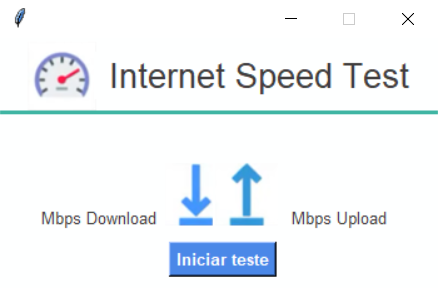
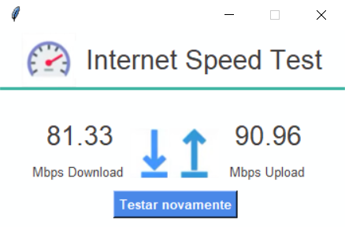

<h1 align="center" style="font-weight: bold;">Internet Speed Test</h1>

<p align="center"> 
    <a href="#funcionalidades">Funcionalidades</a> | 
    <a href="#tecnologiasUtilizadas">Tecnologias Utilizadas</a> | 
    <a href="#comoUsar">Como Usar</a>
</p> 

<p align="center">
    
    
</p>

<p align="center">
    Aplicação desktop desenvolvida em Python para testar a velocidade da conexão com a internet, exibindo valores de download e upload de forma simples e visual através de uma interface gráfica.
</p>

---

<h2 id="funcionalidades">Funcionalidades</h2>

- Teste de velocidade de download da internet.
- Teste de velocidade de upload da internet.
- Interface gráfica simples e intuitiva.
- Atualização dos valores em tempo real após a execução do teste.
- Botão para executar o teste novamente sem reiniciar o aplicativo.

---

<h2 id="tecnologiasUtilizadas">Tecnologias Utilizadas</h2>

- Python 3
- Tkinter (Interface gráfica)
- Pillow (PIL) para manipulação de imagens
- Speedtest-cli (teste de velocidade da internet)

---

<h2 id="comoUsar">Como Usar</h2>

1. Clone este repositório:
```bash
git clone https://github.com/RaffaR902/testador-de-velocidade-de-internet
```
2. Instale as dependências:
```bash
pip install -r requirements.txt
```
3. Execute o arquivo principal do projeto:
```bash
python main.py
```
4. Ao abrir o aplicativo, clique no botão "Iniciar teste".
5. Aguarde alguns segundos até que os valores de download e upload sejam exibidos.
6. Para refazer o teste, clique em "Testar novamente".